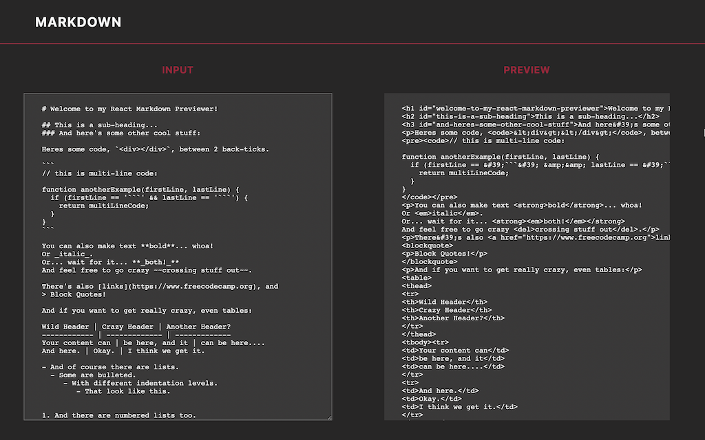

# Markdown-Previewer

[live here](https://mark-converter.netlify.app/)

## THE PROJECT

This project is part of FCC curriculum final projects to obtain the frontend certification

## USER STORY

This project utilizes a user story approach, where we must meet certain criteria in order to pass

### TECH:

1. FRONTEND:
   - ReactJS
   - marked NPM

> ARYSE PAGANO FULL STACK WEB DEVELOPER
